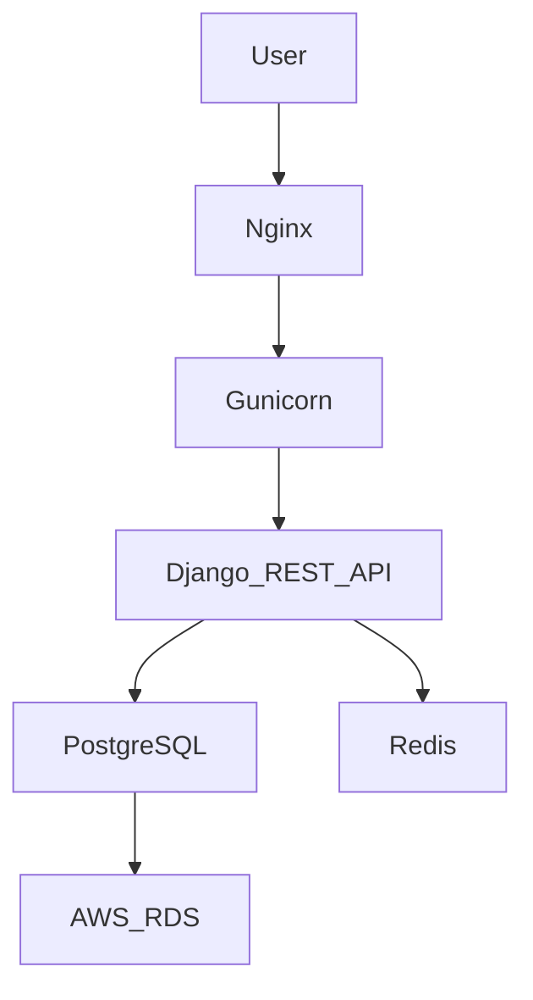

# <div align="center">⚡ SHIVAM PANDEY ⚡</div>

<div align="center">


<br>

<a href="https://www.linkedin.com/in/shivam-pandey-657688374">

</a>

<a href="mailto:shivamp042002@gmail.com">

</a>

<a href="https://github.com/shivamp042002-collab">

</a>

<br><br>


</div>

---

# 🤖 AI Developer Dashboard

<table>
<tr>

<td width="50%">

### 👨‍💻 About Me

```yaml
Name: Shivam Pandey

Role: Backend Engineer

Education:
  B.E Computer Science Engineering
  CGPA: 8.06

Experience:
  Backend Development Instructor
  Technical Mentor

Specialization:
  - Django
  - Django REST Framework
  - AWS
  - Docker
  - PostgreSQL
  - Redis

Current Focus:
  - Scalable Systems
  - Cloud Architecture
  - System Design
  - AI Integration

Open To:
  - Backend Developer Roles
  - Software Engineer Roles
  - Internships
```

</td>

<td width="50%">


</td>

</tr>
</table>

---

# ⚡ Engineering Snapshot

<div align="center">

| Metric                  | Value            |
| ----------------------- | ---------------- |
| 🎓 CGPA                 | 8.06             |
| 👨‍🏫 Students Mentored | 50+              |
| 🔐 APIs Built           | 15+              |
| ☁️ AWS Deployments      | Production Ready |
| 🐳 Docker Projects      | Multiple         |
| 💻 Backend Focus        | Django & DRF     |

</div>

---

# 🛠 Technology Arsenal

<div align="center">

### Languages


### Backend


### Databases


### Cloud & DevOps


### Tools


</div>

---

# 📊 GitHub Analytics

<div align="center">


<br><br>


</div>

---

# 📈 Contribution Intelligence

<div align="center">


</div>

---

# 🚀 Featured Project

<div align="center">

## ConnectPro

Production Ready Recruitment Platform

</div>



### Key Features

* JWT Authentication
* Role Based Access Control
* Secure REST APIs
* Recruiter Dashboard
* Candidate Dashboard
* Docker Deployment
* AWS Hosting
* Scalable Architecture

---

# 💼 Experience

## Backend Development Instructor & Technical Mentor

### IP Academy

* Mentored 50+ students
* Delivered Python & Django training
* Conducted REST API workshops
* Guided deployment projects
* Trained students in Linux, Databases and Git

---

# 🧠 Computer Science Core

<div align="center">


</div>

---

# 🎯 2026 Goals

* Master AWS Architecture
* Learn Kubernetes
* Build SaaS Products
* Contribute to Open Source
* Explore AI + Backend Systems
* Design Scalable Cloud Applications

---

# 💡 Engineering Philosophy

<div align="center">

### "Code should not only work today. It should scale tomorrow."

</div>

---

# 🤝 Connect With Me

<div align="center">

Backend Engineer passionate about cloud computing, scalable systems, software architecture and modern backend development.

<a href="https://www.linkedin.com/in/shivam-pandey-657688374">

</a>

<a href="mailto:shivamp042002@gmail.com">

</a>

</div>

---

<div align="center">


### 🚀 Building Robust Backends, One API at a Time

</div>
